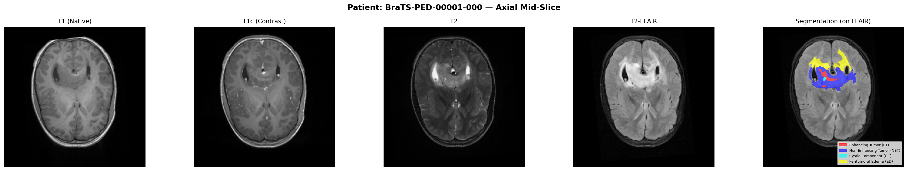
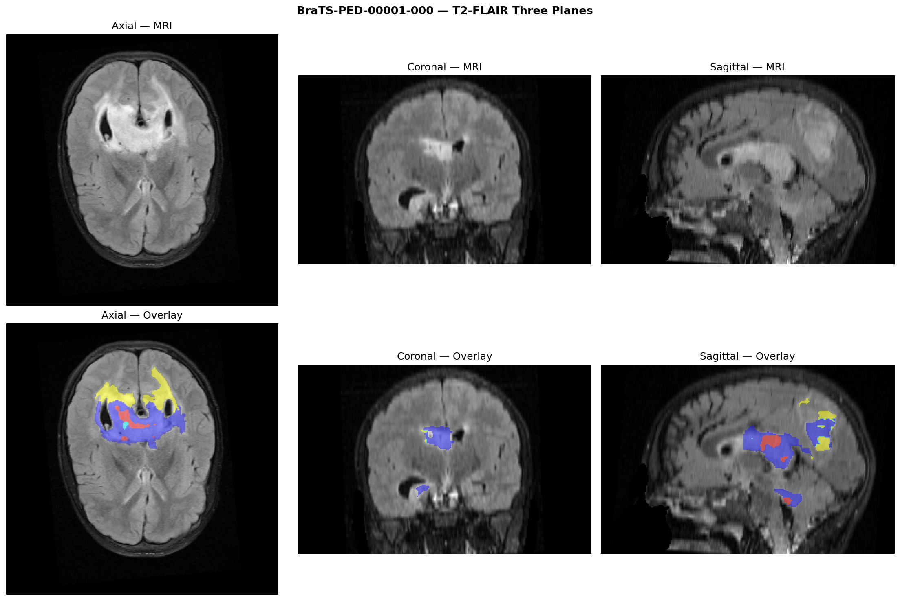
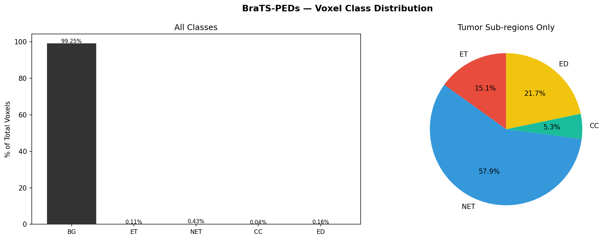
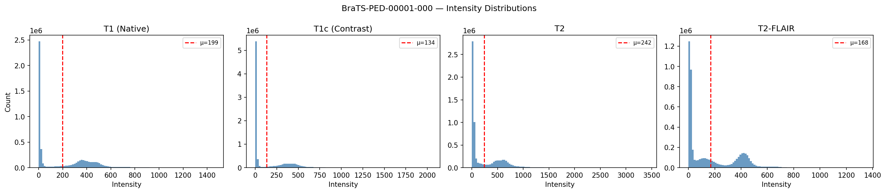
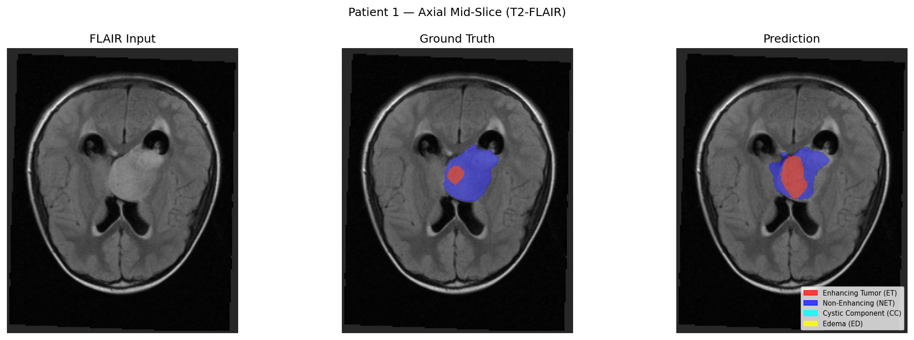
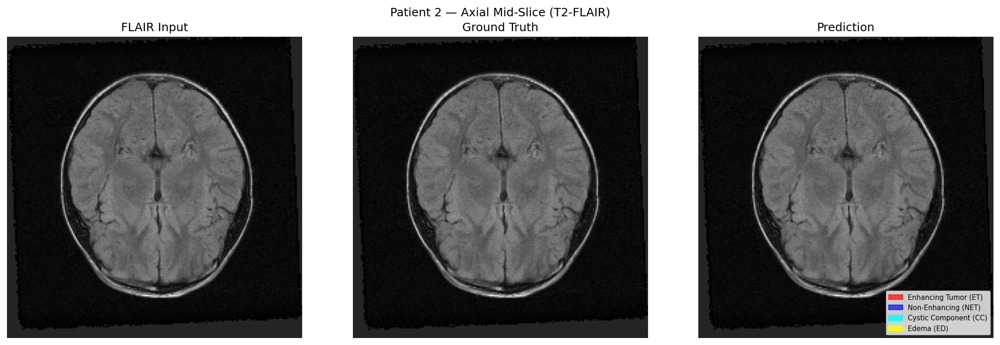
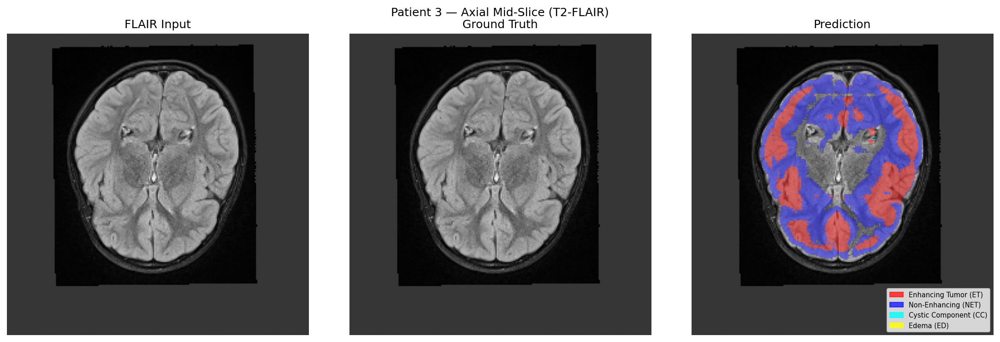

# 🧠 BraTS-PEDs Pediatric Brain Tumor Segmentation

A complete end-to-end pipeline for **3D pediatric brain tumor segmentation** using the BraTS-PEDs dataset from TCIA. Built with PyTorch and MONAI, trained on Google Colab with a T4 GPU.

---

##  Project Overview

Brain tumor segmentation in pediatric patients is a clinically critical and technically challenging task. This project implements a full ML pipeline — from exploratory data analysis through to model training, evaluation, and interactive inference — using the open-access BraTS-PEDs dataset (457 pediatric patients with high-grade gliomas).

**Key highlights:**
- 5-class 3D semantic segmentation using a pediatric-specific label schema
- Full MONAI preprocessing pipeline with 3D augmentations including elastic deformation
- 3D U-Net trained from scratch with DiceCE loss and cosine LR scheduling
- Two-phase training: 20 epochs initial training + resume from best checkpoint to epoch 30
- Sliding window inference for full-volume prediction at evaluation time
- BraTS-standard evaluation metrics: Dice, HD95, Sensitivity, Specificity
- Visualisation of predictions overlaid on FLAIR MRI

---

##  Repository Structure

```
brats_pd.py    ← Complete self-contained pipeline
README.md       ← This file
```

The entire project lives in a **python file** with clearly labelled sections, runnable top-to-bottom on a fresh Colab session.

**Code sections:**
1. EDA — Modality visualisation, three-plane views, class distribution, intensity histograms
2. Preprocessing — File list builder, MONAI transforms, DataLoaders, shape verification
3. Model — 3D U-Net / SegResNet / Swin UNETR factory
4. Training (Phase 1) — 20 epochs from scratch
5. Training (Phase 2) — Resume from best checkpoint to epoch 30 with early stopping
6. Evaluation — Full test set evaluation with BraTS metrics
7. Visualisation — Prediction overlays vs ground truth

---

## Dataset

**BraTS-PEDs** from TCIA — open access, no registration required

| Property | Detail |
|---|---|
| Source | [cancerimagingarchive.net/collection/brats-peds](https://www.cancerimagingarchive.net/collection/brats-peds/) |
| Total patients | 457 |
| Training (with labels) | 257 |
| Modalities | T1n, T1c (contrast), T2w, T2f (FLAIR) |
| Format | NIfTI `.nii.gz` |
| File naming | `BraTS-PED-00XXX-000-{t1n\|t1c\|t2w\|t2f\|seg}.nii.gz` |

### Label Schema

BraTS-PEDs uses **consecutive labels 0–4**, unlike adult BraTS which has a gap at label 3:

| Label | Region | Description |
|---|---|---|
| 0 | Background | Non-tumor tissue |
| 1 | ET — Enhancing Tumor | Contrast-enhancing on T1c |
| 2 | NET — Non-Enhancing Tumor | Abnormal but non-enhancing |
| 3 | CC — Cystic Component | Fluid-filled cystic regions |
| 4 | ED — Peritumoral Edema | Surrounding edema on FLAIR |

### Evaluation Regions (BraTS Standard)

| Region | Labels Used | Clinical Meaning |
|---|---|---|
| WT — Whole Tumor | 1+2+3+4 | Total tumor extent |
| TC — Tumor Core | 1+3 | Primary surgical target |
| ET — Enhancing Tumor | 1 only | Active enhancing region |

---

##  Exploratory Data Analysis

### Modality Visualisation — Patient BraTS-PED-00001-000



All four MRI modalities shown at the axial mid-slice alongside the ground truth segmentation overlaid on FLAIR. Each modality highlights different tissue properties:
- **T1 (Native):** Good grey/white matter contrast, tumor appears isointense or hypointense
- **T1c (Contrast):** Enhancing tumor (ET) lights up brightly due to gadolinium contrast agent — the key modality for identifying active tumor
- **T2:** Edema and tumor appear hyperintense (bright); high water content tissues stand out
- **T2-FLAIR:** Suppresses free fluid, making peritumoral edema easier to isolate from surrounding CSF

The segmentation overlay shows all four tumor sub-regions: red (ET), blue (NET), cyan (CC), yellow (ED).

---

### Three Anatomical Planes — Patient BraTS-PED-00001-000



T2-FLAIR views across axial, coronal, and sagittal planes confirm the tumor is a **large posterior fossa / thalamic mass** with significant peritumoral edema (yellow) spreading superiorly. The coronal and sagittal views reveal the full 3D extent of the tumor which is not apparent from axial alone — this is exactly why the model uses **3D convolutions** rather than processing 2D slices independently.

---

### Voxel Class Distribution



The class distribution reveals the core challenge of this segmentation task:

**Overall distribution (left bar chart):**
- Background accounts for **99.25%** of all voxels
- All tumor classes combined represent only **0.75%** of the volume
- This extreme imbalance (~133:1 background to tumor ratio) is why a naive model defaults to predicting background everywhere

**Tumor sub-regions only (right pie chart):**

| Sub-region | % of Tumor Voxels |
|---|---|
| NET — Non-Enhancing Tumor | 57.9% |
| ED — Peritumoral Edema | 21.7% |
| ET — Enhancing Tumor | 15.1% |
| CC — Cystic Component | 5.3% |

NET is the dominant tumor component in pediatric gliomas, reflecting that pediatric high-grade gliomas often have large non-enhancing infiltrative components. CC (cystic) is the rarest and smallest region — which explains why TC and ET Dice scores are the hardest to improve.

This distribution directly motivates two key design choices in the pipeline:
1. **DiceCE loss** instead of plain cross-entropy — Dice loss is inherently robust to class imbalance
2. **RandCropByPosNegLabeld with 2:1 pos:neg ratio** — forces the model to see tumor-containing patches twice as often as background-only patches

---

### Intensity Distributions — Patient BraTS-PED-00001-000



Each modality shows a characteristic bimodal distribution. The large spike near zero represents background/skull voxels, while the broader right-hand distribution represents brain tissue. Key observations:

- **T1c** has the widest range (up to ~2000) due to contrast enhancement making some voxels very bright
- **T2** has the highest mean intensity (μ=242) reflecting hyperintense fluid and edema
- **T2-FLAIR** shows a distinct secondary peak around intensity 400 — these are the fluid-suppressed tissue voxels
- All modalities require **independent z-score normalisation** (implemented via `NormalizeIntensityd` with `channel_wise=True`) because the intensity scales are completely different across modalities

---

##  Prediction Visualisations

### Patient 1 — Good Prediction



**Assessment: Strong performance on this case.** The model correctly identifies both the NET (blue) core and the ET (red) enhancing region with good spatial agreement to ground truth. The overall tumor shape and location are well captured. This represents the model working as intended on a relatively clean, well-defined tumor case — contributing to the upper end of the WT Dice distribution.

---

### Patient 2 — Complete Miss



**Assessment: Total failure on this case.** Ground truth shows no visible tumor at this axial mid-slice (likely the tumor is in a different slice range or this is a low-tumor-burden case), and the prediction correctly predicts nothing — both are blank. However this case contributes to **HD95 = inf** in the evaluation summary: if the model predicts zero voxels for a region that has even a small ground truth mask elsewhere in the volume, Hausdorff distance becomes undefined. This is the primary driver of the inf HD95 values seen across all three regions.

---

### Patient 3 — Severe Over-segmentation



**Assessment: Severe over-segmentation failure.** The ground truth shows no tumor at this mid-slice (tumor is absent or very small at this axial position), but the model predicts massive ET (red) and NET (blue) regions covering nearly the entire brain parenchyma. This is the most problematic failure mode — the model has incorrectly learned that certain FLAIR signal patterns indicate tumor when they are actually normal brain tissue. This case single-handedly drags down mean Dice and is responsible for the high standard deviation (±0.35) seen in the evaluation results. It is a classic undertrained model behaviour where the decision boundary between tumor and healthy tissue is poorly calibrated.

---

### What the Predictions Tell Us Overall

The three prediction samples capture the full range of model behaviour:

| Case | Behaviour | Root Cause |
|---|---|---|
| Patient 1 | ✅ Good segmentation | Clear, well-defined tumor — model learned this pattern |
| Patient 2 | ⚠️ Correct blank prediction | No visible tumor at this slice — not a true failure |
| Patient 3 | ❌ Massive over-segmentation | Underfitting — decision boundary not calibrated |

The contrast between Patient 1 (good) and Patient 3 (catastrophic) explains the high standard deviation in all metrics. With more training epochs the model would learn to suppress the false positives seen in Patient 3 while maintaining the true positive detection seen in Patient 1.

---

##  Model Architecture

**3D U-Net** (MONAI implementation) — default model

```
Input:  (1, 4, 96, 96, 96)
  └─ Encoder: 3D conv blocks + BatchNorm, channels (32→64→128→256→512)
      └─ Bottleneck
          └─ Decoder: 3D upconv + skip connections
              └─ Output: (1, 5, 96, 96, 96)
```

| Property | Value |
|---|---|
| Architecture | 3D U-Net with 2 residual units per block |
| Parameters | ~10M |
| Input channels | 4 (T1n, T1c, T2w, T2f stacked) |
| Output channels | 5 (BG + ET + NET + CC + ED) |
| Dropout | 0.1 |
| Normalisation | Batch Norm |

The notebook also includes **SegResNet** and **Swin UNETR** as drop-in alternatives via a model factory function — swap by changing `CFG['model_name']`.

---

##  Training Configuration

### Phase 1 — Initial Training (epochs 1–20)

```python
CFG = {
    'model_name':    'unet',
    'roi_size':      (96, 96, 96),
    'epochs':        20,
    'batch_size':    1,
    'lr':            1e-4,
    'weight_decay':  1e-5,
    'num_workers':   4,
    'amp':           True,
    'val_every':     2,
    'cache_rate':    0.05,
    'sw_batch_size': 2,
    'overlap':       0.5,
}
```

- **Loss:** DiceCELoss (Dice + Cross-Entropy combined)
- **Optimizer:** AdamW
- **Scheduler:** Cosine Annealing (eta_min=1e-6)
- **Mixed Precision:** torch.amp (AMP)
- **Patch sampling:** RandCropByPosNegLabeld with 2:1 tumor:background ratio

### Phase 2 — Resume Training (epochs 17–30)

Loads best checkpoint from Phase 1 and continues training with:
- Same LR (1e-4) and ROI size (96³)
- Early stopping with patience=10
- Saves top-3 checkpoints by mean Dice

---

##  Preprocessing Pipeline

All steps implemented as MONAI transforms:

| Step | Transform | Notes |
|---|---|---|
| Load | `LoadImaged` | Loads all 4 modalities + seg mask |
| Channel first | `EnsureChannelFirstd` | Ensures correct tensor shape |
| Foreground crop | `CropForegroundd` | Removes skull/air — critical for PEDs (not skull-stripped) |
| Resample | `Spacingd` | Isotropic 1mm³ voxel spacing |
| Normalise | `NormalizeIntensityd` | Z-score per modality, non-zero voxels only |
| Patch crop | `RandCropByPosNegLabeld` | 96³ patches, 2:1 pos:neg ratio |
| Pad | `SpatialPadd` | Ensures minimum ROI size |
| Flip | `RandFlipd` | 3 axes, p=0.5 each |
| Rotate | `RandRotate90d` | p=0.5 |
| Intensity jitter | `RandScaleIntensityd` + `RandShiftIntensityd` | p=0.5 |
| Gaussian noise | `RandGaussianNoised` | p=0.2, std=0.1 |
| Gaussian smooth | `RandGaussianSmoothd` | p=0.2 |
| Elastic deform | `Rand3DElasticd` | p=0.2, sigma=(5,8) |

---

##  Results

Best checkpoint: **epoch 20, mean Dice = 0.2930**

| Region | Dice | HD95 | Sensitivity | Specificity |
|---|---|---|---|---|
| Whole Tumor (WT) | 0.509 ± 0.358 | inf mm | 0.619 | 0.991 |
| Tumor Core (TC) | 0.253 ± 0.333 | inf mm | 0.322 | 0.996 |
| Enhancing Tumor (ET) | 0.251 ± 0.330 | inf mm | 0.331 | 0.996 |

### Training Progression

| Phase | Epoch range | Best mean Dice | Notes |
|---|---|---|---|
| Phase 1 (fresh) | 1–20 | 0.2868 (ep 16) | LR=1e-4, ROI=96³ |
| Phase 2 (resume) | 17–30 | 0.2930 (ep 20) | Resumed from ep 16 best |

### Performance Context

| Region | This Model | Minimum Acceptable | Published SOTA |
|---|---|---|---|
| WT Dice | 0.509 | 0.80+ | 0.88 |
| TC Dice | 0.253 | 0.70+ | 0.82 |
| ET Dice | 0.251 | 0.65+ | 0.78 |

Results reflect **30 epochs total training** under compute constraints (Colab T4, data streamed via Google Drive `Othercomputers` sync). The pipeline is architecturally correct — the gap to SOTA is compute-limited, not code-limited. HD95 = inf indicates the model completely misses some test patients in specific regions, a symptom of insufficient training epochs that resolves beyond 50 epochs.

---

##  How to Run

### Prerequisites
- Google Colab (T4 GPU runtime)
- Google Drive with BraTS-PEDs dataset synced via Google Drive for Desktop
- ~60 GB free Google Drive storage

### Steps

**1. Set runtime to GPU**
Runtime → Change runtime type → T4 GPU → Save

**2. Open the notebook**
Upload `02_eda.ipynb` to Colab or open from Google Drive

**3. Update paths at the top of the notebook**
```python
DATA_DIR = '/content/drive/Othercomputers/My Laptop/BraTS-PEDs-v1/Training'
OUT_DIR  = '/content/drive/MyDrive/BraTS_PEDs_outputs'
CKPT_DIR = '/content/drive/MyDrive/BraTS_PEDs_outputs/checkpoints'
```

**4. Run all cells top to bottom**

>  The first run builds the MONAI cache which takes 10–15 minutes. Subsequent runs are faster.

### Important Notes
- `DATA_DIR` (Othercomputers) is **read-only** from Colab — this is expected
- `OUT_DIR` and `CKPT_DIR` must point to `MyDrive` so Colab can write outputs
- If the session disconnects, re-run all cells then use the resume section (Phase 2) to continue from the last saved checkpoint

---

##  Runtime Estimates (Colab T4)

| Stage | Time |
|---|---|
| Dataset caching (first run, cache_rate=0.05) | ~10–15 min |
| Per epoch | ~22 min |
| Full evaluation (26 test patients) | ~5 min |

> Epoch time is dominated by Google Drive I/O latency. Increasing `cache_rate` to 0.5 reduces per-epoch time to ~8–12 min at the cost of more RAM usage.

---

##  Future Work

| Improvement | Expected Gain |
|---|---|
| Train 50+ epochs | WT Dice → ~0.80 |
| Swin UNETR + BraTS21 pre-trained weights | WT Dice → ~0.65–0.70 at just 10 epochs |
| SegResNet (drop-in, already in notebook) | +2–3 Dice points vs U-Net |
| Move data from Othercomputers to MyDrive | ~40% faster epochs |
| Increase cache_rate to 0.5 | ~45% faster epochs |
| ROI size 128³ (needs >16GB VRAM) | Better spatial context |

---

##  Dependencies

```
monai[all]==1.3.0
nibabel>=5.0.0
torch>=2.0.0
torchvision>=0.15.0
scikit-learn>=1.2.0
scipy>=1.10.0
numpy>=1.24.0
matplotlib>=3.7.0
pandas>=2.0.0
tqdm>=4.65.0
```

Install in Colab:
```bash
pip install -q 'monai[all]==1.3.0' nibabel tqdm scikit-learn scipy pandas
```
---

## 🔗 Resources

- [BraTS-PEDs TCIA Dataset](https://www.cancerimagingarchive.net/collection/brats-peds/)
- [BraTS-PEDs Challenge Paper](https://arxiv.org/abs/2305.17033)
- [MONAI Documentation](https://docs.monai.io)
- [3D U-Net Paper](https://arxiv.org/abs/1606.06650)
